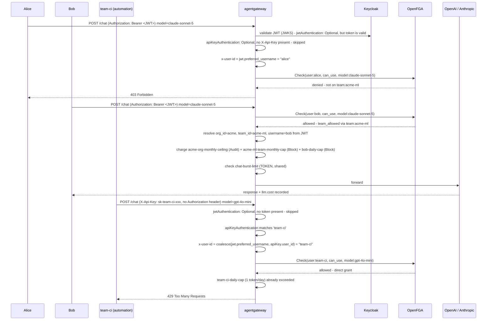
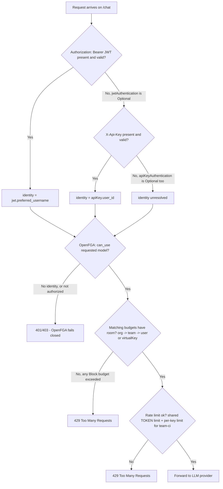

# Tiered Cost Control — Multi-Tier AuthN/AuthZ/Budget/Rate-Limit

One gateway, one `/chat` endpoint, two ways in: human developers via Keycloak JWT, and
automation/CI via a virtual API key. Both share the same models, the same OpenFGA
model-access gate, and the same budget/rate-limit machinery — differentiated entirely by
which credential resolved, not by which route they hit. Everything here is a native
agentgateway/enterprise capability: no custom ext-proc sidecar, no Postgres, no bespoke
reservation service.

## Motivation

AI spend doesn't map to a flat "requests per second" budget. A platform team fronting several
LLM providers usually needs to answer four different questions about the same request stream:

1. **Who is calling?** (authN) — a human via SSO, or a service account/CI pipeline via a static
   credential.
2. **What are they allowed to call?** (authZ) — not every caller should reach the most
   expensive model.
3. **How much can they spend, and at what level of the org?** (budget) — an individual
   developer's daily cap, a team's monthly allocation, and an org-wide ceiling are three
   different numbers, not one.
4. **How fast can they call it?** (rate limit) — a budget resets daily or monthly at the
   fastest; it does nothing to stop a runaway loop from doing damage in the next ten seconds.

This use case answers all four with agentgateway/enterprise's native primitives, composed the
way this repo's other cost-control use cases already do it — `budget-limits`, `model-costs`,
`rate-limit`, `virtual-keys`, `keycloak-jwt-auth`, `openfga-authz` — plus `org_id`/`team_id`/
`username` budget dimensions declared in the base profile's `budgetDimensions.config` Helm
value, to unlock a genuine org → team → user budget hierarchy instead of collapsing everything
to per-user or per-key.

## Who's who

| Identity  | AuthN                                | OpenFGA relationship               | JWT claims                       | Model access              | Budget subject                  |
| --------- | ------------------------------------ | ---------------------------------- | -------------------------------- | ------------------------- | ------------------------------- |
| `alice`   | Keycloak JWT                         | `org:acme` member                  | `org_id=acme`                    | cheap + mid model         | `org_id`, `username`            |
| `bob`     | Keycloak JWT                         | `org:acme` + `team:acme-ml` member | `org_id=acme`, `team_id=acme-ml` | cheap + mid + **premium** | `org_id`, `team_id`, `username` |
| `team-ci` | Virtual API key (`X-Api-Key` header) | direct grant on the cheap model    | —                                | cheap model only          | `virtualKey`                    |

`alice`/`bob`'s OpenFGA relationships are the ones already seeded by the `openfga` addon for
the `security/openfga-rebac` use case (`org:acme`, `team:acme-ml` — see
`addons/openfga/index.js`). `team-ci` gets its own direct grant there too, mirroring the
addon's existing `mcp-user` service identity — the same pattern already used for non-human
callers. This use case also adds `org_id`/`team_id` attributes to `alice`/`bob`'s Keycloak users
(see `config/profiles/agentgateway-with-keycloak.yaml`) so their JWTs carry the same org/team
story their OpenFGA tuples already encode — one source of truth for "who's on what team,"
expressed twice because authZ (OpenFGA) and budget (JWT claims) are two independent engines
that don't share state.

## Architecture at a glance

| Layer                | Mechanism                                                               | Feature                   | Native primitive                                                |
| -------------------- | ----------------------------------------------------------------------- | ------------------------- | --------------------------------------------------------------- |
| AuthN (human)        | Keycloak JWT, **Optional** mode, Gateway-wide                           | `keycloak-jwt-auth`       | `EnterpriseAgentgatewayPolicy.traffic.jwtAuthentication`        |
| AuthN (automation)   | Virtual API key, **Optional** mode, read from `X-Api-Key`, Gateway-wide | `virtual-keys`            | `EnterpriseAgentgatewayPolicy.traffic.apiKeyAuthentication`     |
| Identity projection  | `x-user-id` = JWT username, falling back to the API key's identity      | `keycloak-jwt-auth`       | `traffic.transformation` (`coalesce(jwt[...], apiKey[...])`)    |
| AuthZ                | OpenFGA ReBAC via ext_authz, on the `/chat` route                       | `openfga-authz`           | `EnterpriseAgentgatewayPolicy.traffic.extAuth`                  |
| Cost dimensions      | Custom budget subjects (`org_id`, `team_id`, `username`)                | base profile `helmValues` | `budgetDimensions.config` Helm value                            |
| Budget               | 5 independent budgets: org → team → user (USD) + automation (Tokens)    | `budget-limits`           | `EnterpriseAgentgatewayBudget` + `traffic.entBudgetEnforcement` |
| Rate limit (shared)  | TOKEN burst limit on `/chat`, applies to everyone                       | `rate-limit`              | `RateLimitConfig` + `traffic.entRateLimit`                      |
| Rate limit (per-key) | Tighter TOKEN limit just for `team-ci`, bundled with its API key        | `virtual-keys`            | its own `RateLimitConfig`                                       |
| Pricing              | USD cost catalog for all 3 models                                       | `model-costs`             | `EnterpriseAgentgatewayParameters.modelCatalog`                 |

Both authN policies live at the **Gateway** level and get merged into one policy object; authZ,
budget, and rate limit all live at the **`/chat` HTTPRoute** level and get merged into a
_separate_ policy object. That split is load-bearing — see "Why it's built this way" below.

## Sequence diagram



## Decision diagram



An unauthenticated request (neither JWT nor API key) isn't explicitly denied by a dedicated
rule — both auth checks are `Optional`, so neither one rejects it on its own. It's OpenFGA that
provides the actual backstop: with no identity to check, it fails closed. Every matched budget
is charged independently, not as a single walk up a tree — a request against the premium model
that clears all three human budgets is charged against **all three simultaneously** (see
"No isolation or fallback" below).

## Budget hierarchy

| Budget                     | Subject               | Unit   | Amount | Window | On exceeded                   |
| -------------------------- | --------------------- | ------ | ------ | ------ | ----------------------------- |
| `acme-org-monthly-ceiling` | `org_id: acme`        | USD    | 200    | Month  | Audit (safety net, logs only) |
| `acme-ml-team-monthly-cap` | `team_id: acme-ml`    | USD    | 50     | Month  | Block                         |
| `alice-daily-cap`          | `username: alice`     | USD    | 5      | Day    | Block                         |
| `bob-daily-cap`            | `username: bob`       | USD    | 10     | Day    | Block                         |
| `team-ci-daily-cap`        | `virtualKey: team-ci` | Tokens | 1      | Day    | Block                         |

`team-ci`'s 1-token budget is deliberately tiny so the test suite can deterministically exercise
Block behavior (the same trick `cost-management/budget-and-spend-limits` uses for `bob`). Like
USD/COST budgets, a Tokens budget is pre-reserved before the request goes out - the request's
estimated cost exceeds the 1-token cap immediately, so a single real request is rejected with 429
without ever reaching the LLM provider. A real automation pipeline would size this to its actual
volume — e.g. 500,000 tokens/month — not 1 token/day.

## Why it's built this way (native engine internals worth knowing)

- **Combining two `Strict` auth methods on one route is an AND, not an OR.** The proxy runs
  every configured auth check and rejects if _any_ of them fails - it doesn't treat
  `jwtAuthentication` and `apiKeyAuthentication` as alternatives. With both `Strict`, a JWT-only
  caller gets rejected for lacking an API key, and an API-key-only caller gets rejected for
  lacking a JWT (confirmed via live testing on an EKS cluster: both directions failed with
  distinct 401s). Setting **both to `Optional`** makes each check pass-through when its own
  credential is absent, so a caller only needs one of the two. There's no dedicated "require at
  least one" setting - here, OpenFGA's fail-closed behavior on an unresolved identity is what
  actually enforces that at least one must be present.
- **JWT and API-key auth both default to reading the `Authorization: Bearer` header** - so
  running them side by side on one route means the JWT parser tries (and hard-fails) to parse a
  raw API key as a malformed token. Moving the API key to its own header
  (`apiKeyAuthentication.location.header.name: X-Api-Key`) avoids that collision entirely; JWTs
  keep using `Authorization`.
- **The identity handed to OpenFGA has to come from whichever method actually resolved.**
  `keycloak-jwt-auth`'s claim-to-header projection only reads JWT claims by default,
  which leaves `x-user-id` empty for an API-key-only caller. Its `claimHeaders[].fallback` option
  (used here as `apiKey['user_id']`) turns the projection into
  `coalesce(jwt['preferred_username'], apiKey['user_id'])`, so both authN paths feed the same
  ReBAC check.
- **Merging `jwtAuthentication` into the same policy object as `extAuth` breaks identity
  resolution.** This was the hardest constraint found in this design. Confirmed empirically, not
  read from docs: scoping the JWT policy to the `/chat` _route_ (instead of the Gateway) puts it
  in the same merged `EnterpriseAgentgatewayPolicy` as the route's own `openfga-authz` (extAuth)
  policy - and every request then failed with `401 missing user identity`, with the OpenFGA
  adapter never even receiving the call. Keeping JWT authentication at the **Gateway** level and
  `extAuth`/budget/rate-limit at the **Route** level - two separate policy objects, matching how
  `security/openfga-rebac` already does it - avoids the problem entirely. This is why
  `keycloak-jwt-auth` and `virtual-keys` in this use case both target the Gateway (their
  default), while `openfga-authz`/`budget-limits`/`rate-limit` explicitly target
  `providers-chat-route`.
- **USD budgets and cost-based rate limiting are the same mechanism.** Under the hood, a
  `USD`-unit `EnterpriseAgentgatewayBudget` compiles to a `COST`-type limit on the same
  rate-limit-server wire protocol used by `rate-limit`/`virtual-keys` (µUSD counters), with real
  pre-request reservation and post-response settlement against actual token usage and the
  `model-costs` catalog. That `COST` limit type is only reachable through the Budget CRD,
  though - `rate-limit`'s own `entRateLimit`/`RateLimitConfig` mechanism only ever supports
  `REQUEST`/`TOKEN`, confirmed directly in the enterprise proxy source. There's no way to build
  a native "$/minute" burst limiter; burst protection here is necessarily TOKEN-based.
- **Budget windows are coarse by design.** `EnterpriseAgentgatewayBudget.window.unit` only
  accepts `Day`/`Week`/`Month`/`Year` - there's no `Minute`/`Hour` option, even though the
  underlying rate-limit protocol supports them. That's why this use case pairs the budget tier
  with a separate `rate-limit` TOKEN policy for burst protection instead of trying to make the
  budget itself fine-grained.
- **USD amounts are whole dollars, minimum $1.** The CRD enforces `amount >= 1` as an integer -
  there's no cents-level granularity, unlike the deprecated custom ext-proc stack this replaces.
  A single chat request costs a small fraction of a cent, so a USD budget can't be
  deterministically exhausted by one demo request; that's why the org/team/user budgets are
  demonstrated via successful requests (inspect `llm.cost`/`agw.ai.usage.cost.total` in the
  request logs) rather than a forced 429, while the automation tier's Tokens budget (which does
  support tiny integer amounts) is used for the deterministic Block test.
- **`virtualKey` resolves from the API key's metadata field named `id`, not the Secret's own
  data-key name.** The shipped default dimension is `virtualKey: apiKey.id`, and `apiKey.*` is
  the API key's `metadata` JSON object flattened verbatim onto the CEL namespace (confirmed by
  reading the enterprise proxy source - `UserMetadata` is an arbitrary `serde_json::Value`; the
  Secret entry's own key name, e.g. `team-ci`, is only used internally to look up the hashed
  credential and is discarded after that). `features/virtual-keys` originally only wrote
  `metadata: { user_id: ... }` for its own rate-limit CEL action - which meant `apiKey.id` was
  always empty and `virtualKey`-scoped budgets silently never matched, on this use case and on
  `cost-management/budget-and-spend-limits`. Fixed by also writing `metadata.id`.
- **Subject dimensions aren't hardcoded - only `model`/`provider` are.** Everything else -
  `group`/`user`/`virtualKey` (the chart's shipped defaults) plus this use case's own
  `org_id`/`team_id`/`username` - lives in one plain ConfigMap
  (`agentgateway-enterprise-budget-dimensions`) that the enterprise-agentgateway chart renders
  directly from the `budgetDimensions.config` Helm value. The full six-entry set is declared in
  the base profile (`config/profiles/eks-enterprise-agentgateway-complete.yaml`), not patched in by
  this use case at deploy time: an earlier version patched the ConfigMap out-of-band via
  `kubectl patch`, which worked until upgrading to Helm v4's server-side-apply-by-default broke
  it - Helm's own re-apply of the chart's rendered ConfigMap on every `agw install` conflicted
  with the field ownership `kubectl patch` had claimed. Declaring the full set as a Helm value
  instead means Helm is the only writer, so there's nothing to conflict with.
- **No automatic isolation or fallback between budget levels.** Unlike the deprecated
  custom ext-proc stack (see `docs/quota-management-architecture.md`'s `isolated`/
  `allow_fallback` semantics), the native engine has no concept of a child budget "fencing" its
  parent or falling back to a parent's remaining capacity. Every budget whose `subject` matches
  the request is evaluated and charged independently - a request against the premium model
  debits the org ceiling, the team cap, _and_ the user's own cap in the same request, and any one
  of them saying `Block` rejects the request regardless of what capacity remains elsewhere.

## Running

```bash
# Prerequisites: agentgateway-with-keycloak and agentgateway-with-openfga profiles installed
# (Keycloak + OpenFGA addons), ENTERPRISE_AGENTGATEWAY_LICENSE and OPENAI_API_KEY/
# ANTHROPIC_API_KEY set.

agw usecase deploy --name cost-management/tiered-cost-control

# alice: allowed on the cheap model, denied on the premium one
# bob: allowed on both
# team-ci: allowed on the cheap model via API key, blocked by its own tiny budget
agw usecase test --name cost-management/tiered-cost-control
```

Inspect the agentgateway request logs after a successful `/chat` call to see `llm.cost` and
`agw.ai.usage.cost.total` populated from the attached `model-costs` catalog, and the
`x-budget-remaining-usd`/`x-budget-id` response headers for whichever budgets matched.
